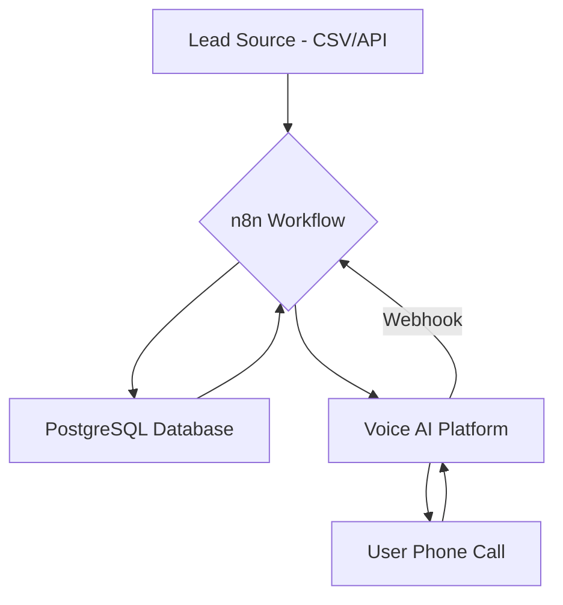

# 🤖 AI Voice Calling & Lead Qualification System


A resilient, autonomous outbound calling system designed to handle high-throughput lead qualification campaigns. This project uses **n8n** for workflow orchestration, a **Voice AI Platform** (like Bolna, Retell, or Tabbly) for conversational AI, and **PostgreSQL** for resilient state management.

This repository is a production-ready template for building and deploying sophisticated voice agents for sales, support, and customer engagement.

## ✨ Key Features

-   **High-Concurrency Orchestration:** Manages multiple concurrent calls using cron-based batch scheduling and dynamic throttling.
-   **Resilient State Management:** PostgreSQL-backed system to track call lifecycles (`pending` → `calling` → `completed` / `failed`).
-   **Automated Retries & Callbacks:** Intelligently queues unanswered or failed calls for retry while preventing duplicates.
-   **Dynamic Agent Prompts:** Includes multiple, highly-optimized agent prompts for different personas and scenarios (e.g., `Raveena`, `Vikram`).
-   **Advanced Hangup & Extraction Logic:** Sophisticated prompts to control call termination and extract structured data (e.g., eligibility, interest, CGPA).
-   **Bulk Lead Ingestion:** HTTP endpoint for uploading CSV lead lists directly into the calling queue.
-   **Analytics-Ready:** Captures detailed call metrics (duration, transcript, sentiment, qualification status) for reporting and dashboards.

## 🛠️ Architecture Overview

The system is built on a robust, decoupled architecture:

1.  **Workflow Orchestrator (n8n):** The brain of the operation. It manages the logic, handles webhooks, and communicates with the database and AI platform.
2.  **Voice AI Platform:** The voice of the operation. Handles the real-time conversation with the user.
3.  **Database (PostgreSQL):** The memory of the operation. Persists lead data, call queue status, and campaign analytics.



## 📂 Project Structure

The repository is organized to be clean, scalable, and easy to navigate:

```
.env.example
.gitignore
README.md
requirements.txt

/prompts
  /agents
    raveena_agent_prompt.md
    vikram_agent_prompt.md
  /logic
    hangup_prompt.md
    extraction_prompt.md

/sql
  create_call_queue.sql
  create_leads_table.sql

/workflows
  main_orchestrator.json
  lead_ingestion.json

/utils
  csv_parser.py
```

## 🚀 Getting Started

### Prerequisites

-   An **n8n** instance (Cloud or self-hosted)
-   A **PostgreSQL** database
-   An account with a **Voice AI Platform** (e.g., Retell, Tabbly, Bland)
-   Python 3.8+

### 1. Database Setup

Connect to your PostgreSQL instance and run the setup scripts:

```bash
psql -U your_user -d your_db -f sql/create_leads_table.sql
psql -U your_user -d your_db -f sql/create_call_queue.sql
```

### 2. Environment Variables

Create a `.env` file from the `.env.example` and fill in your credentials:

```bash
cp .env.example .env
# Edit .env with your credentials
```

### 3. n8n Configuration

1.  Import the workflows from the `/workflows` directory into your n8n instance.
2.  Configure your **PostgreSQL** and **HTTP Request** nodes with the credentials from your `.env` file.
3.  Activate the workflows.

## 📝 Usage

### Uploading Leads

Send a POST request to the `lead_ingestion` workflow's webhook endpoint with your CSV data.

```bash
curl -X POST https://your-n8n-instance/webhook/upload-leads \
  -F "file=@/path/to/your/leads.csv"
```

### Monitoring the Campaign

Check the `call_queue` table for real-time status updates:

```sql
SELECT status, COUNT(*) FROM call_queue GROUP BY status;
```

## 📄 License

This project is licensed under the MIT License. See the [LICENSE](LICENSE) file for details.
